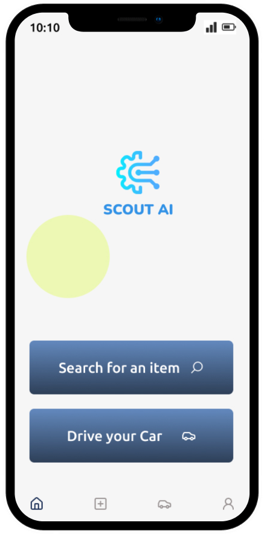
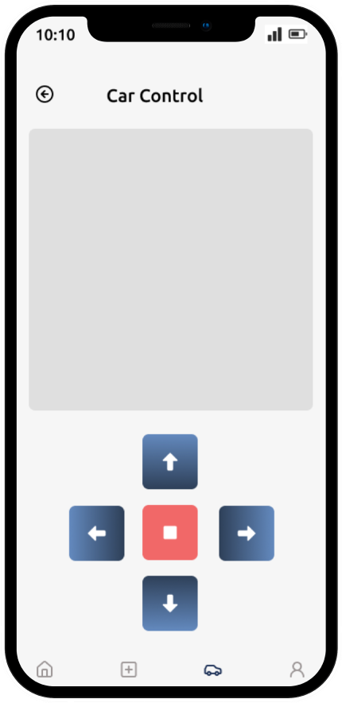
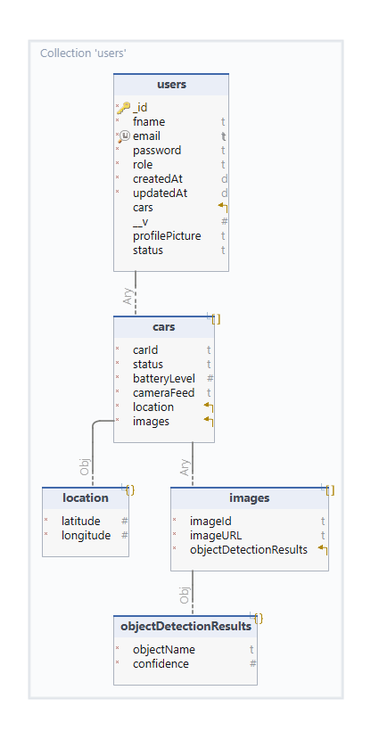

  

<!-- project philosophy -->

> A mobile app for seamlessly detecting items and controlling a self-driving car, making it easier for users to automate tasks and find objects without manual intervention.
>
> Our IoT app aims to enhance the automation process by providing a user-friendly platform for customers to remotely control a self-driving car and use its camera to detect items with precision. We believe in improving efficiency and user satisfaction by leveraging cutting-edge technology and machine learning.

### User Stories
- As a user, I want to open the camera within the app to detect items, so I can identify objects around me.
- As a user, I want to connect my mobile app to a self-driving car, so I can control it remotely and perform tasks
- As a user, I want the self-driving car to search for and detect items, so I can automate tasks like finding specific objects.

  
<!-- Tech stack -->

###  Scout AI is built using the following technologies:

- This project uses the [Flutter app development framework](https://flutter.dev/). Flutter is a cross-platform hybrid app development platform which allows us to use a single codebase for apps on mobile, desktop, and the web.
- For persistent storage (database), the app uses the [Hive](https://hivedb.dev/) package which allows the app to create a custom storage schema and save it to a local database.
- To send local push notifications, the app uses the [flutter_local_notifications](https://pub.dev/packages/flutter_local_notifications) package which supports Android, iOS, and macOS.
- The app uses the font ["Work Sans"](https://fonts.google.com/specimen/Work+Sans) as its main font, and the design of the app adheres to the material design guidelines.

  
### Mockups

| Home screen                             | Signup Screen                           | Car Control Screen                          |
| --------------------------------------- | ------------------------------------- | ------------------------------------- |
|  |  |  |

  
### Architecting Data Excellence: Innovative Database Design Strategies:

| ER Diagram                             |
| --------------------------------------- |
|  |

  
