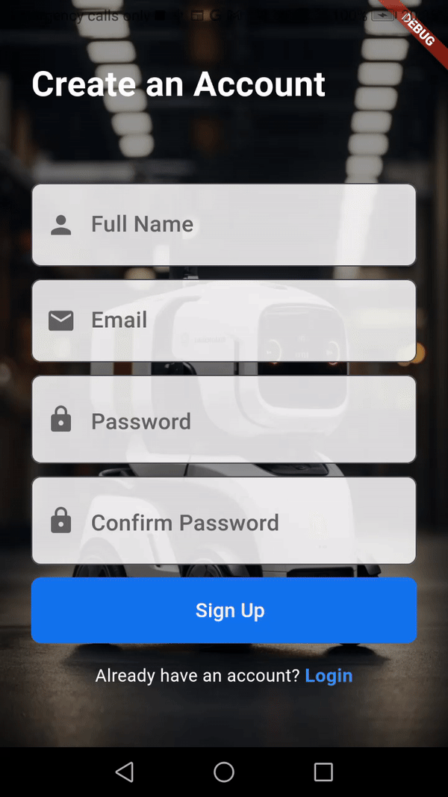
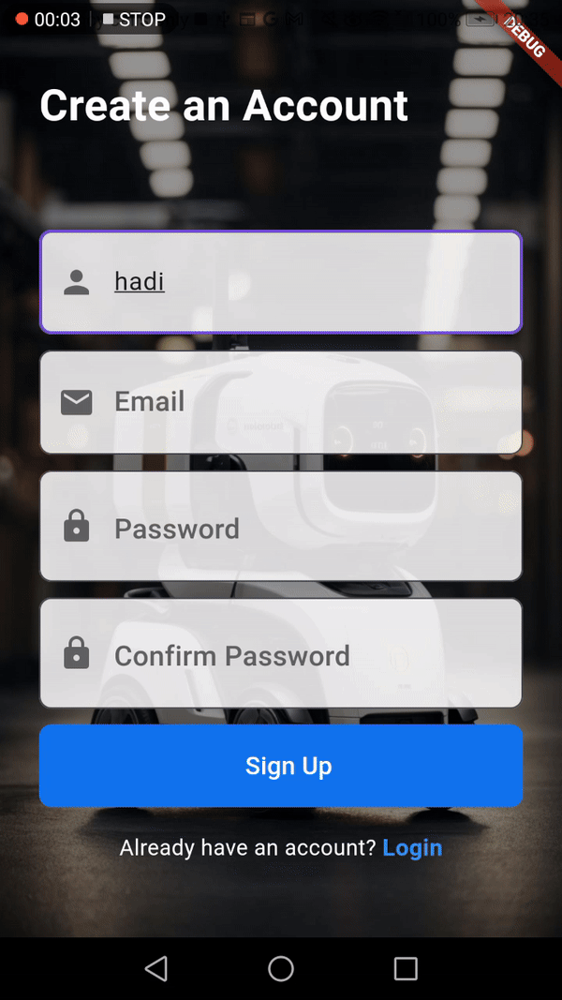
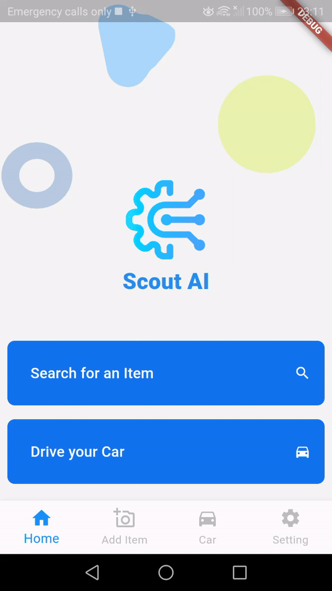
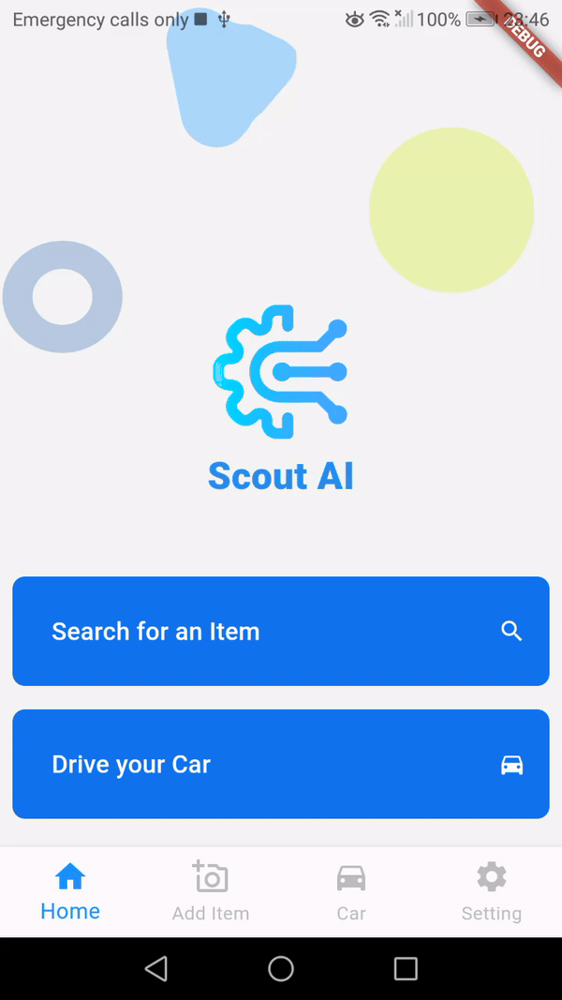
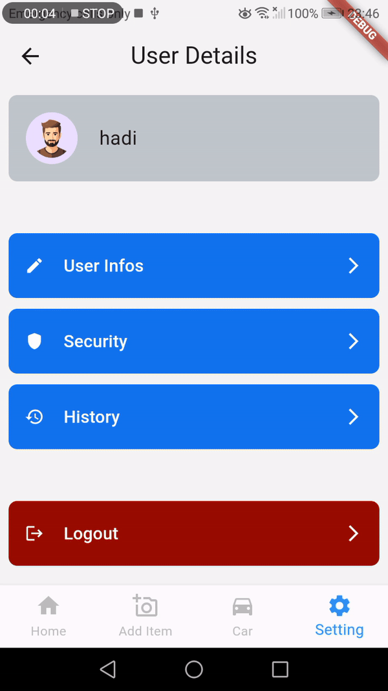
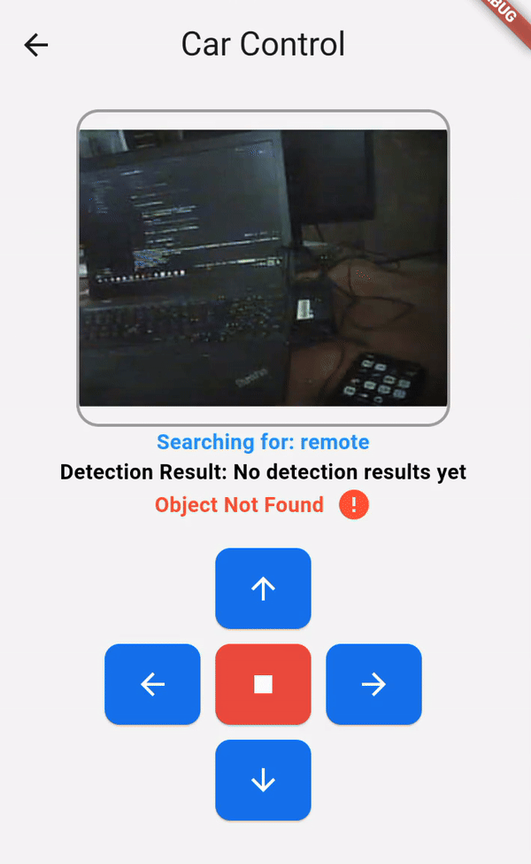

<br><br>

<!-- project philosophy -->


> A mobile app for seamlessly detecting items and controlling a self-driving car, making it easier for users to automate tasks and find objects without manual intervention.
>
> Our IoT app aims to enhance the automation process by providing a user-friendly platform for customers to remotely control a self-driving car and use its camera to detect items with precision. We believe in improving efficiency and user satisfaction by leveraging cutting-edge technology and machine learning.

### User Stories
- As a user, I want to open the camera within the app to detect items, so I can identify objects around me.
- As a user, I want to connect my mobile app to a self-driving car, so I can control it remotely and perform tasks
- As a user, I want the self-driving car to search for and detect items, so I can automate tasks like finding specific objects.


<br><br>
<!-- Tech stack -->


###  Scout AI is built using the following technologies:

- This project uses the [Flutter app development framework](https://flutter.dev/). Flutter is a cross-platform hybrid app development platform which allows us to use a single codebase for apps on mobile, desktop, and the web.
- For persistent storage (database), the app uses the [Hive](https://hivedb.dev/) package which allows the app to create a custom storage schema and save it to a local database.
- To send local push notifications, the app uses the [flutter_local_notifications](https://pub.dev/packages/flutter_local_notifications) package which supports Android, iOS, and macOS.
- The app uses the font ["Work Sans"](https://fonts.google.com/specimen/Work+Sans) as its main font, and the design of the app adheres to the material design guidelines.

<br><br>
### Mockups

| Home screen                             | Signup Screen                           | Car Control Screen                          |
| --------------------------------------- | ------------------------------------- | ------------------------------------- |
|  |  |  |

<br><br>
### Architecting Data Excellence: Innovative Database Design Strategies:

| ER Diagram                             |
| --------------------------------------- |
|  |

<br><br>
<!-- Implementation -->


### User Screens (Mobile)

| Register Screen                              | Login Screen                         | Enter item name                          |
| ----------------------------------------- | --------------------------------------- | --------------------------------------- |
|  |  |  |
| Car Control Screen                              |Settings Screen                         | User Infos Screen                          |
|  |  |  |

### Arduino Simulation

| Car Control                              | Item ditection                         |
| ----------------------------------------- | --------------------------------------- |
|  |  |

<!-- How to run -->


> To set up Scout-AI locally, follow these steps:

### Prerequisites

-   ESP32-CAM Module (Hardware)
-   4WD Car kit (Hardware)
-   L298N motor driver module (Hardware)
-   antenna (Hardware)
-   NEO-7M GPS (Hardware)
-   7-12 V DC Battery (Hardware)
-   Breadboard (Hardware)
-   Double sided tape (Hardware)
-   Glue gun (Hardware)
-   Jumper wires (Hardware)

### Installation

1. Clone the main repo with its submodels
    ```sh
    git clone --recurse-submodules https://github.com/Ali-Hadi-Saker/Scout-AI.git
    ```
2. Download MongoDB from https://www.mongodb.com/, then run the installer

3. Go to Scout-AI-Back-End repo
    ```sh
    cd Scout-AI-Back-End
    ```
4. To install the needed dependencies in package.json
    ```sh
    npm install
    ```
5. Start the Server
    ```sh
    npm run dev
    ```
6. To run the the detection model 
    ```sh
    cd Scout-AI-Object-Detection
    ```
7. Install the needed libraries
   ```sh
    pip install -r requirements.txt
    ```
8. Run detection model
   ```sh
    python main.py
    ```   
9. Install [Flutter SDK](https://docs.flutter.dev/get-started/install?gclid=Cj0KCQiAveebBhD_ARIsAFaAvrEXbca0gKEuW9ROxwC86eiEtJUUO5tm-AIIzds41AXpzsjkbESCw2EaAsTwEALw_wcB&gclsrc=aw.ds)

10. Go to Scout-AI-Flutter directory
    ```sh
    cd Scout-AI-Flutter
    ```
11. Install pub packages
    ```sh
    flutter pub get
    ```
12. Run Scout-AI-Flutter
    ```sh
    flutter run
    ```

### Hardware Setup 

-   Uploading code

1. Connect yor hardware as shown in the readme/arduino-schema directory

2. Connect the arduino to the computer

3. Install [Arduino IDE](https://docs.arduino.cc/software/ide-v2/tutorials/getting-started/ide-v2-downloading-and-installing) (You can use alternative aurduino IDE's)

4. In Scout-AI-Car-Control, change the following variables to match your wifi credentials and setup
    ```cpp
    const char* ssid = "your_wifi_ssid";
    const char* password = "your_wifi_password";
    ```

6. Upload arduino code into ESP32-Cam board


Now, you are all set to control the car and detect items.
